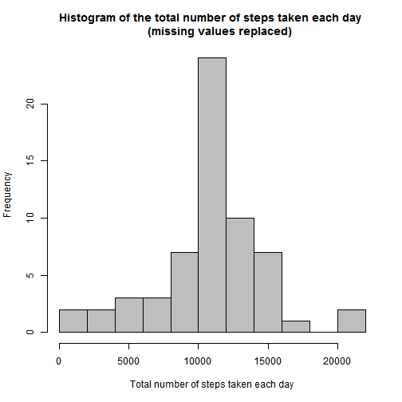

##Introduction
This markdown file is used to satisfy the requirements for the Reproducible Research Peer Assessment 1 Assignment.  

The data for this assignment can be downloaded from the course web site:
https://d396qusza40orc.cloudfront.net/repdata%2Fdata%2Factivity.zip

The data should already be downloaded and exist in a directory called 'Data' inside of your working directory prior to 
running Knit HTML.

##Data
The data used in the analysis is from a personal activity monitoring device. This device collects data at 5 minute intervals through out the day. The data consists of two months of data from an anonymous individual collected during the months of October and November, 2012 and include the number of steps taken in 5 minute intervals each day.

The variables included in this dataset are:

    steps: Number of steps taking in a 5-minute interval (missing values are coded as NA)

    date: The date on which the measurement was taken in YYYY-MM-DD format

    interval: Identifier for the 5-minute interval in which measurement was taken

The dataset is stored in a comma-separated-value (CSV) file and there are a total of 17,568 observations in this dataset.

##Load and preprocess the data
Load the data and format date

```r
data <- read.csv("./Data/activity.csv")
data$date <- as.Date(data$date, format = "%Y-%m-%d")
```


Summarize dataset to calculate the total number of steps taken per day and average number of steps taken at each interval accross all days

```r
library(plyr)
sumsteps <- ddply(data, .(date), summarize, steps = sum(steps, na.rm = TRUE))
avgsteps <- ddply(data, .(interval), summarize, avg = mean(steps, na.rm = TRUE))
```


Create a new dataset with the missing values replaced with the average number of steps taken at the interval. Summarize the new dataset to calculate the total number of steps taken per day and average number of steps taken at each interval accross all weekday or weekend days.

```r
newdata <- merge(data, avgsteps, by.x = "interval", by.y = "interval")
newdata$steps[is.na(newdata$steps)] <- newdata$avg[is.na(newdata$steps)]
newdata <- subset(newdata, select = c("steps","date","interval"))
## Determine whether the date is a weekday or weekend
newdata$wend <- as.factor(ifelse(weekdays(newdata$date, abbreviate = FALSE) 
                              %in% c("Saturday","Sunday"), "weekend", "weekday"))                  

## Summarise dataset to calculate the total number of steps taken per day
newsumsteps <- ddply(newdata, .(date), summarize, steps = sum(steps, na.rm = TRUE))

## Summarise dataset to calculate the average number of steps across all weekday days or weekend days
newavgsteps <- ddply(newdata, .(interval, wend), summarize, avg = mean(steps, na.rm = TRUE))
```


##Analysis
###What is mean total number of steps taken per day?

Create histogram of the total number of steps taken each day and report the mean and median.

```r
summarize <- summarize(sumsteps, 
                       mean = mean(steps, na.rm = TRUE), 
                       median = median(steps, na.rm = TRUE))
mean <- round(summarize$mean,2)
median <- summarize$median

hist(sumsteps$steps,
     breaks = 15,
     col = "gray",
     main = "Histogram of the total number of steps taken each day",
     xlab = "Total number of steps taken each day")
```

 

The mean is 9354.23. The median is 10395.

###What is the average daily activity pattern?

```r
maximum <- subset(avgsteps, avg == max(avg), select = interval)

library(lattice)
xyplot(avg ~ interval, data = avgsteps, type = "l", ylab = "average number of steps")
```

 

The 5-minute interval with the maximum number of steps on average across all the days is the 835 interval.

###Imputing missing values

```r
## Calculate the total number of missing values in the dataset
count <-length(data$steps[is.na(data$steps)])

## Calculate and report the mean and median of the total number of steps taken per day
newsummarize <- summarize(newsumsteps, 
                       mean = mean(steps, na.rm = TRUE), 
                       median = median(steps, na.rm = TRUE))
newmean <- round(newsummarize$mean,2)
newmedian <- newsummarize$median

## Calculate the impact of replacing missing data
diff <- newsummarize - summarize
meandiff <- round(diff$mean,2)
mediandiff <- round(diff$median,2)

## Histogram of the total number of steps taken each day
hist(newsumsteps$steps,
     breaks = 15,
     col = "gray",
     main = "Histogram of the total number of steps taken each day 
     (missing values replaced)",
     xlab = "Total number of steps taken each day")
```

 

There are 2304 missing values in the dataset.  The missing values were replace with the average number of steps for the corresponding interval.  The new mean is 1.076619 &times; 10<sup>4</sup> which increased from the original dataset by 1411.96. The new median is 1.0766189 &times; 10<sup>4</sup> which increased by 371.19.

###Are there differences in activity patterns between weekdays and weekends?

```r
xyplot(avg ~ interval | wend, 
       data = newavgsteps, 
       type = "l",
       ylab = "average number of steps",
       layout=(c(1,2)))
```

 
